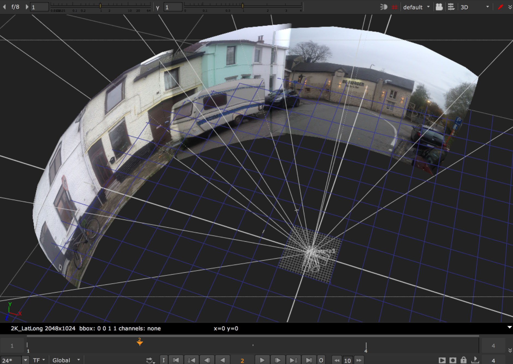
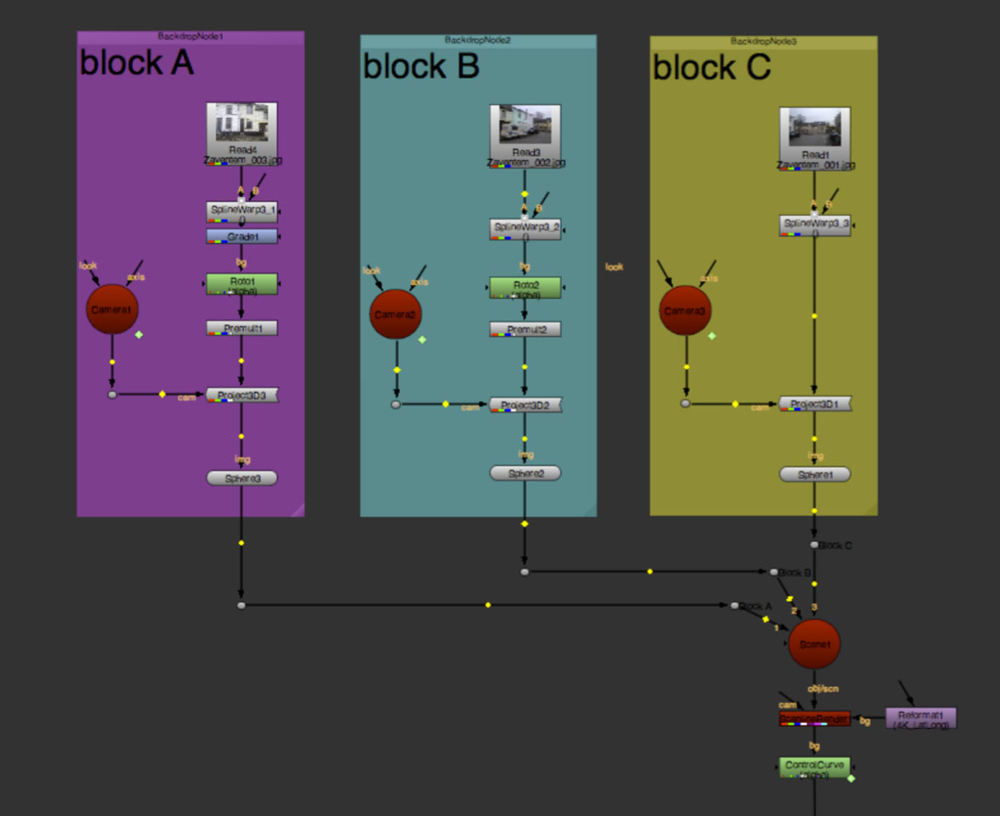
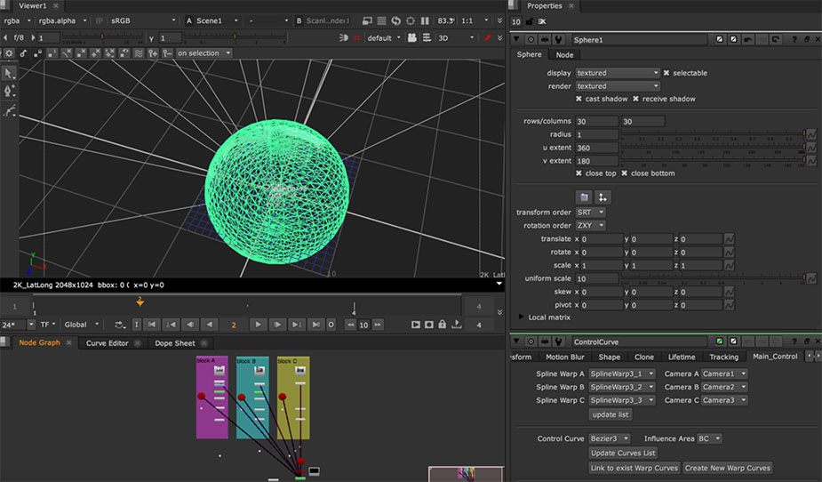
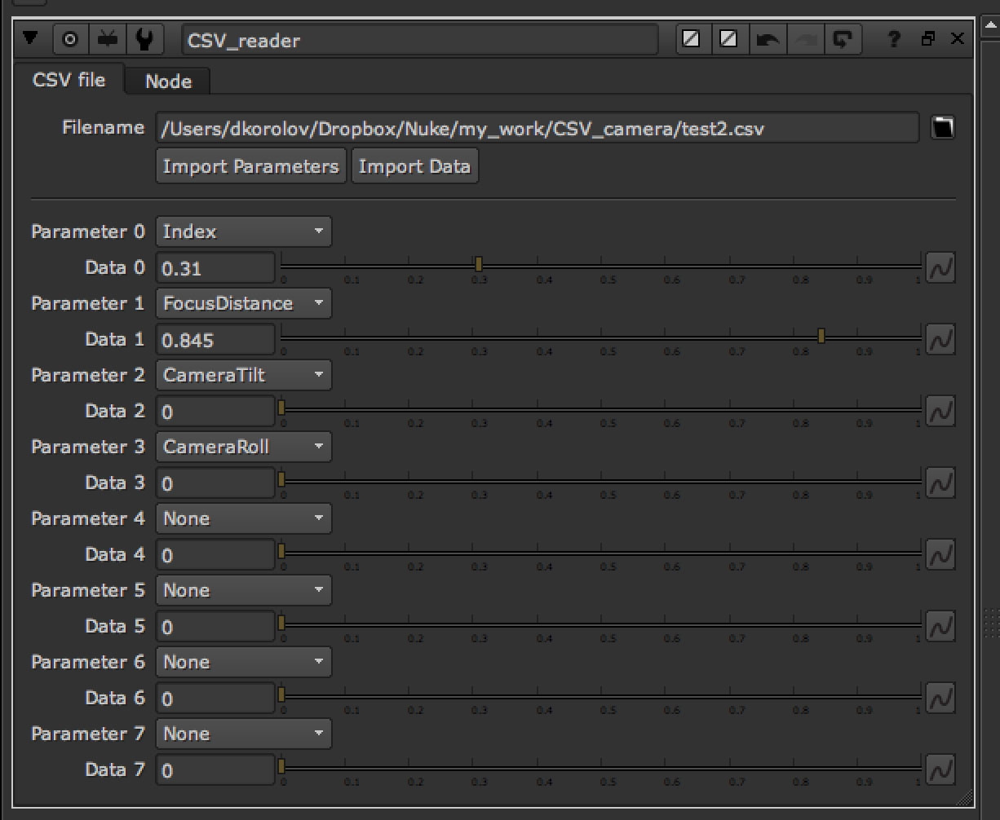
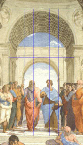
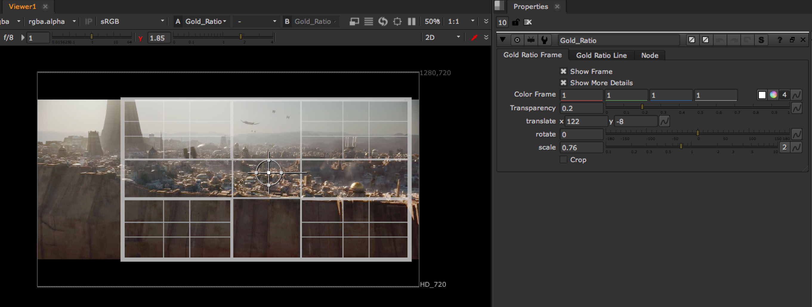
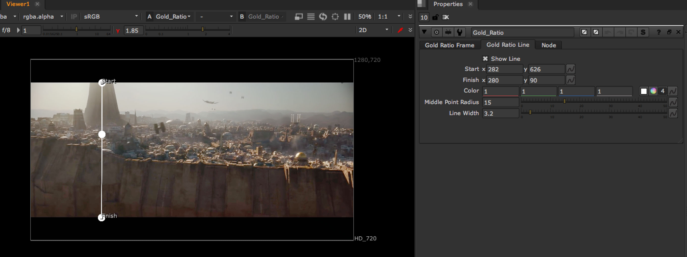

nukeTools
=========

This repository contain tools for Nuke compositing software created by
Dmytro Korolov <https://www.linkedin.com/in/dmytrokorolov/> 
 

Retime Helper
-------------

RetimeHelper is a custom Tab for retime nodes or gizmo  (Kronos, OFlow, custom
gizmo). It helps create and fine tune retime curves from video editors or
editorial data.

 

Stitch_tool
-----------

Stitch_tool is a custom tool inside Nuke, that help seamless stitching images of
video from multi- camera rig for projecting its on 3D sphere and using as
background. It created used standard Nuke nodes + Python. It use «intellectual»
image distortion of camera rig videos with SplineWarp nodes for having perfect
stitching. Simple stich with physically correct Nuke camera set up according
real rig usually not give perfect result. Images at the stich edges need to be a
little distorted to stich become perfect. To do this was created Stitch_tool

 

Some documentation is in [PDF](python/stich_tool/Stich_tool User Guide.pdf).
 Tutorial about tool for clear understanding is
here <https://www.youtube.com/watch?v=Qypo7GPOU1A> 

 

CSV reader
----------

Python based tool useful for import CSV data (for example data from camera)
directly to Nuke. Tool create knobs with animation curves based on CSV data.
This curves can be linked to Nuke camera  or any other node. This property makes
the tool universal, not related only to camera data

 

Golden Ratio gizmo
------------------

This Gizmo helps artists visualize Golden Ratio proportion

Just as the Golden Section is found in the design and beauty of nature, it can
also be used to achieve beauty, balance and harmony in art and design.  It’s a
tool, not a rule, for composition, but using it can give great results.

For those with a deeper understanding yet, the golden ratio can be used in more
elegant ways to create aesthetics and visual harmony in any branch of the design
arts.

The Golden Ratio is a special number found by dividing a line into two parts so
that the longer part divided by the smaller part is also equal to the whole
length divided by the longer part (see fig 1) a/b = (a+b)/a = 1.618.
Historically, this ratio can be seen in the architecture of many ancient
creations, like the Great Pyramids (the Golden Triangle is also based on the
Golden Ratio) and the Parthenon.  The Golden Ratio was used to attain beauty and
balance in many paintings and sculptures. Da Vinci used the Golden ratio to
delineate all of the proportions in his Last Supper.

 
